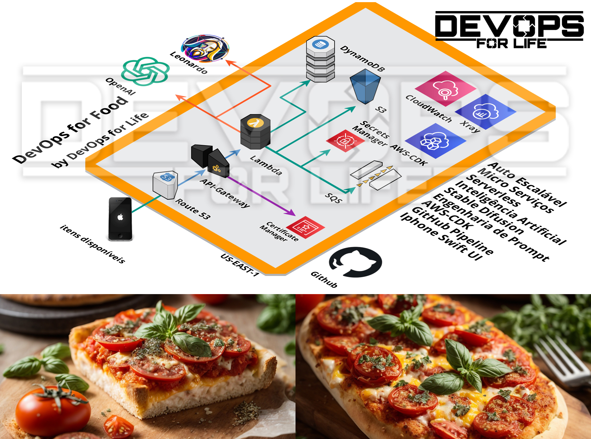
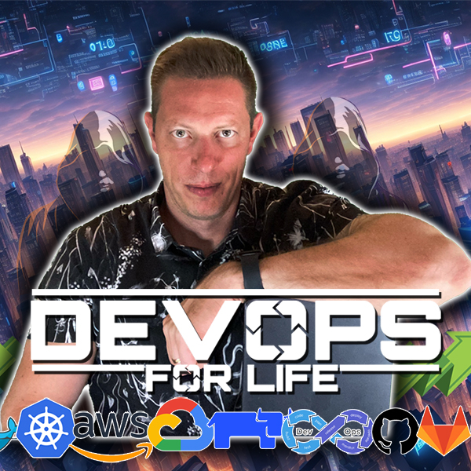

# DevOps for Food

# DevOps For Life

Este repositório pertence a comunidade DevOps for Life.

http://devopsforlife.io

Acesse e aproveite o cupom de desconto para usuários do GitHub!

# 1) Introdução
    Uma visão geral do que será abordado no curso.
##  Aula 1:  Arquitetura que iremos construir e serviços que iremos usar.
##  Aula 2:  Inteligência Artificial - AI (Artificial Inteligence)

# 2) Ambiente
    Configurações iniciais e preparação do ambiente de desenvolvimento.
##  Aula 1:  AWS
##  Aula 2:  Conta AWS
##  Aula 3:  Instalação das aws-cli 
##  Aula 4:  Instalacao aws-cdk
##  Aula 5:  conta na OpenAI - Ou usar as respostas estáticas
##  Aula 6:  Conta no Leonardo.ai - Ou usar imagens estáticas e não aprender sobre Stable Diffusion

# 3) Open AI
    Introdução e utilização da plataforma OpenAI.
##  Aula 1:  Modelos LLM - Large Language Model
##  Aula 2:  GPT - Generative Pre-Trained Transformer
##  Aula 3:  Prompt Engenieering
##  Aula 4:  Uso da API
##  Aula 5:  Criar API-key

# 4) Leonardo.Ai
    Entendimento e implementação com a ferramenta Leonardo.Ai.
##  Aula 1:  O que é stable diffusion
##  Aula 2:  Ferramenta, e como iremos usá-la.
##  Aula 3:  Testar e criar a API-key

# 5) Aplicação
    Desenvolvimento e detalhamento da aplicação prática.
##  Aula 1:  funções Lambda, ver no detalhe
##  Aula 2:  Route53
##  Aula 3:  Api-gateway
##  Aula 4:  Lambda
##  Aula 5:  CloudWatch
##  Aula 6:  Certificate Manager
##  Aula 7:  AWS-CDK
##  Aula 8:  x-ray
##  Aula 9:  DynamoDB
##  Aula 10:  S3
##  Aula 11:  Secrets Manager

# 6) Postman
    Descrição detalhada do capítulo.
##  Aula 1:  Como iremos testar a API

# 7) Iphone APP
    Descrição detalhada do capítulo.
##  Aula 1:  xCode - e ambiente de desenvolvimento Apple - 
##  Aula 2:  aplicativo Iphone com Swift UI - 
##  Aula 3:  swiftUi - 
##  Aula 4: - arquivos e testar quando a API esta no ar. 
##  Aula 5: - Mostrar a estrutura do arquivo.
##  Aula 6:  Não quer usar? Vou ensinar a fazer tudo via Postman.

# 8) Pipeline
    Descrição detalhada do capítulo.
##  Aula 1: Github Actions - para fazer o deployment usando o AWS-CDK. 
##  Aula 2:  Explicar o que é o github Actions e como usar ele
##  Aula 3:  Mostrar o código e colocar no repositório
##  Aula 4:  Código
##  Aula 5:  Deployment

# 9) Produção
    Descrição detalhada do capítulo.
##  Aula 1:  Nessa etapa iremos fazer o deployment em produção 
##  Aula 2:  Testes de carga
##  Aula 3:  Monitoramento
##  Aula 4: - Infra
##  Aula 5: - funções - Logs
##  Aula 6: - OpenAI - Custo
##  Aula 7: - Leonardo.AI - Tokens
##  Aula 8:  X-ray - Ver os traces
##  Aula 9:  Alertas - CloudWatch Alerts

# 10) Best Practices - AWS Production
    Descrição detalhada do capítulo.
##  Aula 1:  Melhores práticas com serviços da aws
##  Aula 2: - DynamoDB em prod
##  Aula 3: - S3 em prod

